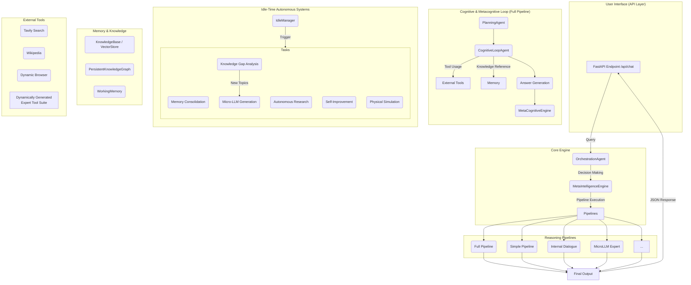

# **Luca4: Self-Evolving Meta-Cognitive AI Framework**

**Luca4** is not just another response-generating AI. It's a self-evolving AI framework that places the concept of "Metacognition" — inspired by human cognitive processes — at its core, continuously growing by evaluating and improving its own thinking processes.

This system not only dynamically adjusts the "depth" and "breadth" of thinking based on user requirements but also **autonomously fine-tunes specialized "Micro-LLMs" tailored to specific domains** to fill knowledge gaps. Furthermore, through integration with physical simulation environments (MuJoCo), it has the capability to learn not just from linguistic information, but also from **physical world intuitions**.

## **✨ Key Features**

Luca4 is a dynamic, self-growing system that integrates the following capabilities:

* **🧠 Evolving Cognitive Architecture**:  
  * **Dynamic Pipeline Selection**: The OrchestrationAgent analyzes user queries and automatically selects the optimal thinking pipeline from **8+ different types** (simple response, full analysis, introspective dialogue, expert model utilization, etc.).  
  * **Predictive Coding**: The PredictiveCodingEngine detects novelty in user input (prediction errors) and uses this as a learning trigger to efficiently update knowledge.  
  * **Digital Homeostasis**: The EthicalMotivationEngine monitors the system's intellectual integrity (logical consistency, values) and motivates actions to maintain stability.  
* **🛠️ Self-Proliferating Expert AI (Micro-LLMs)**:  
  * **Automatic Knowledge Gap Detection**: The KnowledgeGapAnalyzerAgent analyzes its own knowledge graph during idle time to identify topics that users frequently inquire about but where information is lacking.  
  * **Dynamic Fine-tuning**: Based on identified topics, the MicroLLMCreator fine-tunes base models to automatically generate **specialized AI (Micro-LLMs)** tailored to specific domains.  
  * **Integration as Expert Tools**: Generated Micro-LLMs are immediately integrated into the ToolBelt as tools, ready to handle specialized questions in subsequent conversations.  
* **🔍 Self-Reflective RAG (Metacognitive RAG)**:  
  * The RetrievalEvaluatorAgent evaluates the quality (relevance, comprehensiveness) of retrieved information.  
  * When information is insufficient, the QueryRefinementAgent **automatically refines search queries and repeats searches until high-quality information is obtained**.  
* **🕸️ Persistent Knowledge Graph**:  
  * The KnowledgeGraphAgent structures collected information not as mere text, but as a **knowledge graph** that captures relationships between concepts, permanently storing this knowledge. This allows information to be integrated and strengthened over time.  
* **🏃‍♂️ Physical World Learning (Physical World Grounding)**:  
  * **MuJoCo Simulation**: The SimulationManager executes physical simulations such as block stacking.  
  * **Reinforcement Learning**: The PPOAgent learns actions based on physical laws through trial and error in simulation environments.  
  * **Insight Verbalization**: The SimulationEvaluatorAgent analyzes simulation results and generates **linguistically articulated "intuitions" and "insights"** such as "keeping the center of gravity low is key to stability," feeding these back into the thinking process as knowledge.  
* **🌐 Advanced Tool Usage**:  
  * For problems that cannot be solved with internal knowledge alone, the system actively utilizes **Tavily web search**, **Wikipedia search**, and **Playwright browser tools** that can retrieve dynamically generated JavaScript pages.  
* **🌱 Continuous Learning During Idle Time**:  
  * The IdleManager detects user inactive periods and automatically executes the following background tasks:  
    * **Memory Consolidation**: Analyzes short-term memory (conversation content) and integrates it into long-term memory (knowledge graph).  
    * **Autonomous Research**: Conducts autonomous web research on configured topics to continuously expand knowledge.  
    * **Self-Improvement**: Analyzes thinking processes from past conversations to develop and apply strategies for performance improvement.  
    * **Wisdom Synthesis**: Takes a bird's-eye view of the entire knowledge graph to extract universal "wisdom" that transcends individual facts.

## **🏛️ System Architecture**

Luca4 is a highly modularized system where multiple expert AI agents and reasoning pipelines work in coordination, centered around the OrchestrationAgent and MetaIntelligenceEngine as command centers.



## **🚀 Getting Started**

### **1. Environment Setup**

**a. Create Python Virtual Environment**

```bash
python3 -m venv .venv
source .venv/bin/activate
```

**b. Install Required Libraries**  
Use the requirements.txt file in the project root to install all necessary packages:

```bash
pip install -r requirements.txt
```

**c. API Key Configuration (.env file)**  
To use the web search functionality (Tavily), create a .env file in the project root directory and configure your API key:

1. Copy the env.sample file and create a file named .env.  
2. Obtain an API key from [Tavily's official website](https://tavily.com/).  
3. Open the created .env file and enter your API key:

```env
# .env
TAVILY_API_KEY="paste_your_tavily_api_key_here"
```

**d. Playwright Setup**  
Install Playwright browsers for the dynamic browser tool:

```bash
playwright install
```

### **2. Ollama Setup**

This project uses [Ollama](https://ollama.com/), a local LLM platform.

**a. Install Ollama**  
Follow the instructions on the official website to install Ollama.

**b. Download Required Models**  
Execute the following commands in your terminal to download the models used by the project:

```bash
# Text generation and verification model
ollama pull gemma3:latest

# Text embedding model
ollama pull nomic-embed-text
```

### **3. Run the Application**

Once all setup is complete, start the API server with:

```bash
python run.py
```

The server will start and accept requests at http://0.0.0.0:8000.

## **⚡️ API Usage**

### **Interactive API Documentation**

With the server running, access http://localhost:8000/docs in your web browser.  
You'll see interactive API documentation (Swagger UI) automatically generated by FastAPI, where you can review endpoint specifications and test APIs directly.

### **Endpoint: /api/chat**

* **Method**: POST  
* **Description**: Interact with the AI and get responses.  
* **Body**:
  ```json
  {
    "query": "Enter your question here.",
    "session_id": "(Optional) ID for session continuation"
  }
  ```

* **Response**:
  ```json
  {
    "final_answer": "Final response from AI",
    "self_criticism": "AI's self-evaluation of its response",
    "potential_problems": "Potential issues or next questions identified by AI",
    "retrieved_info": "Information referenced during thinking process",
    "session_id": "(Optional) Session ID"
  }
  ```

### **Example Request using curl**

```bash
curl -X POST "http://localhost:8000/api/chat" \
-H "Content-Type: application/json" \
-d '{"query": "Please explain the advantages and disadvantages of nuclear fusion energy from an expert perspective."}'
```

## **⚙️ Configuration**

Project behavior can be adjusted in the `/app/config.py` file:

* **Change LLM Model**: Modify the `model` value in `GENERATION_LLM_SETTINGS` to use other model names available in Ollama.  
* **Autonomous Thinking Intervals**: Adjust values like `AUTONOMOUS_CYCLE_INTERVAL_SECONDS` to change execution frequency of idle-time tasks.  
* **Pipeline Behavior**: Modify values in `PIPELINE_SETTINGS` to fine-tune specific pipeline behaviors (e.g., number of turns in introspective dialogue).  
* **Autonomous Research Topics**: Add items to the `AUTONOMOUS_RESEARCH_TOPICS` list to increase themes that AI researches autonomously.

## **📦 Key Dependencies**

This project depends on the following major libraries. See requirements.txt for details:

* **ollama, langchain, langchain-core, langchain-community**: AI agent and tool frameworks  
* **fastapi, uvicorn**: Web API construction and execution  
* **langchain-tavily, wikipedia, playwright**: External information search and browsing tools  
* **faiss-cpu**: High-speed vector search  
* **dependency-injector**: Clean architecture management via DI container  
* **pydantic**: Strict data structure definition  
* **python-dotenv**: Environment variable management via .env files  
* **gymnasium, mujoco, torch**: Physical simulation and reinforcement learning

## **🤝 Contributing**

We welcome contributions! Please feel free to:

* Report bugs and suggest features through GitHub Issues  
* Submit pull requests for improvements  
* Share your experiences and use cases  
* Contribute to documentation improvements

## **📄 License**

This project is released under the MIT License. See the LICENSE file for details.

## **🌟 Future Roadmap**

* **Multi-modal Learning**: Integration with vision and audio processing capabilities  
* **Distributed Computing**: Support for distributed inference across multiple machines  
* **Advanced Simulation**: More complex physical and social simulation environments  
* **Community Ecosystem**: Plugin system for community-contributed specialized agents  
* **Real-time Learning**: Continuous learning from live data streams

---

**Luca4** represents a new paradigm in AI systems — one that doesn't just respond to queries, but continuously evolves, learns, and improves itself. Join us in building the future of truly intelligent AI systems.